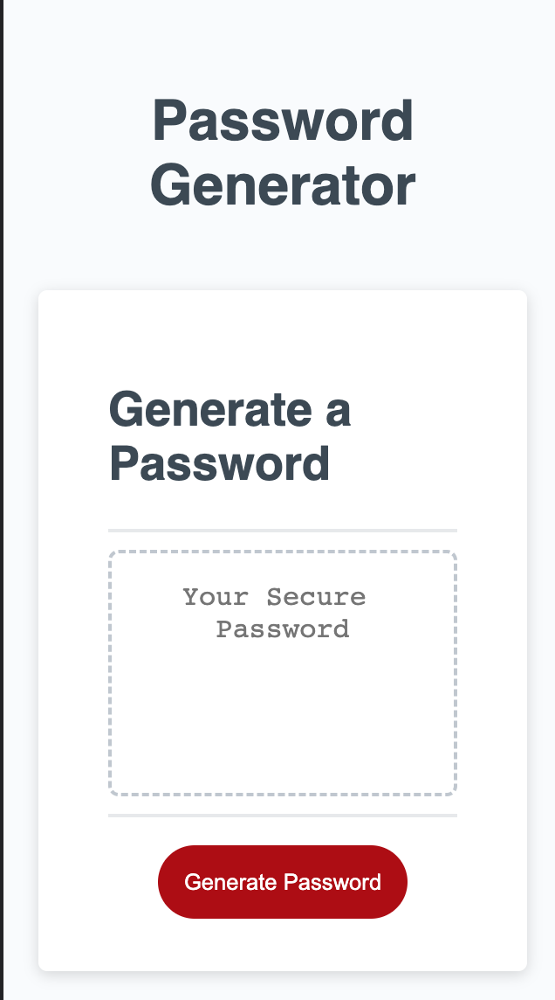
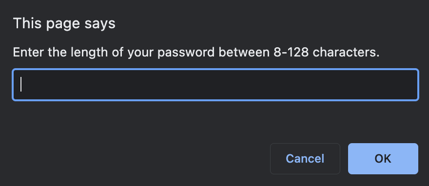
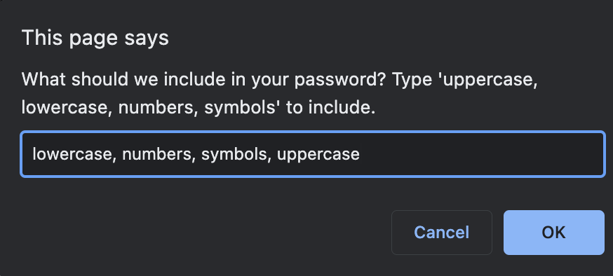
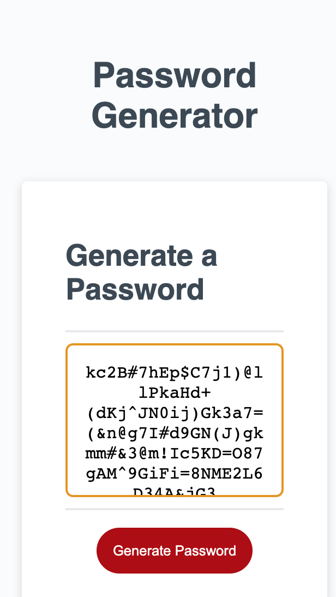
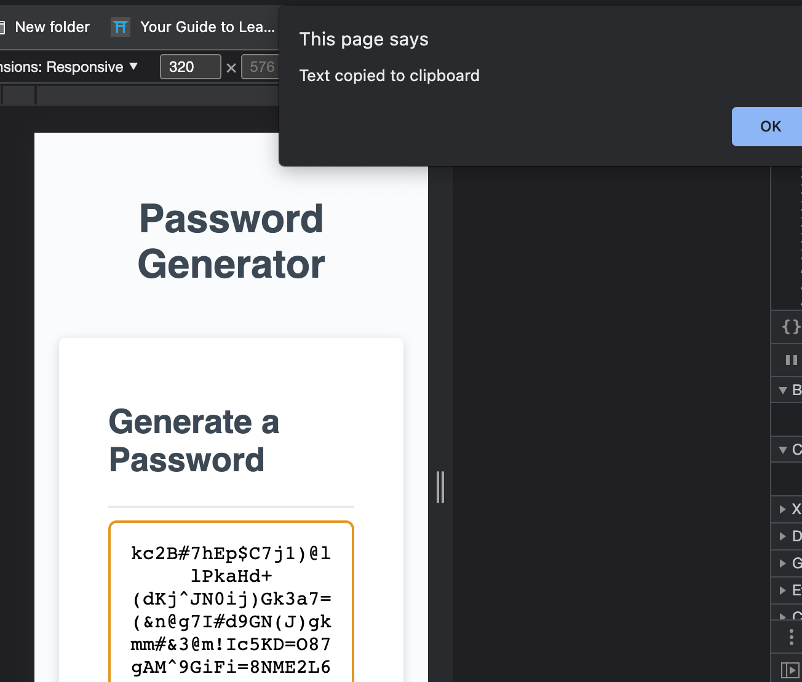

# Password Generator

This password generator is a tool to create a random password with options to include different character types for practical use. 

## Description

When you access this webpage on any device, you can click "Generate Password" to generate prompts, which will let you decide how long you'd like your password to be, along with character types you would like to include. You can enter more than one character type, seperated by a comma.

When you've generated your random password, it will appear in the Textbox.

Click on the text box to copy it to your clipboard.

## Getting Started

## Authors

Contributors names and contact info

Samantha Gosselin
samanthag2009@gmail.com

## Version History

* 0.1
    * Initial Release

## Acknowledgments

* [DomPizzie ReadMe Template](https://gist.github.com/DomPizzie/7a5ff55ffa9081f2de27c315f5018afc)
* [Users WOUNDEDStevenJones and domellum on Stack Overflow](https://stackoverflow.com/questions/74880037/javascript-random-password-generator-with-prompts-for-criteria)
* [W3schools How to Copy to Clipboard](https://www.w3schools.com/howto/howto_js_copy_clipboard.asp)
* [User blex on Stack Overflow](https://stackoverflow.com/questions/62627469/random-password-generator-with-prompts)
